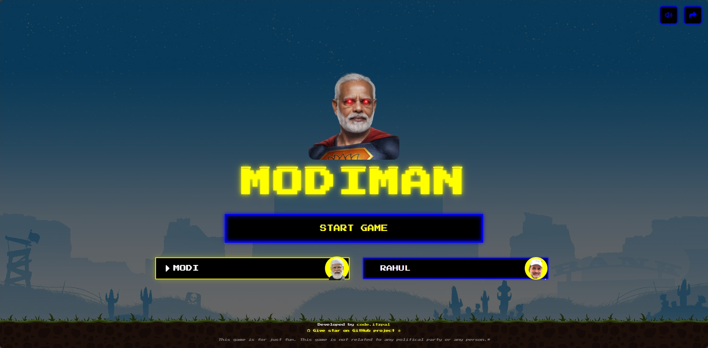
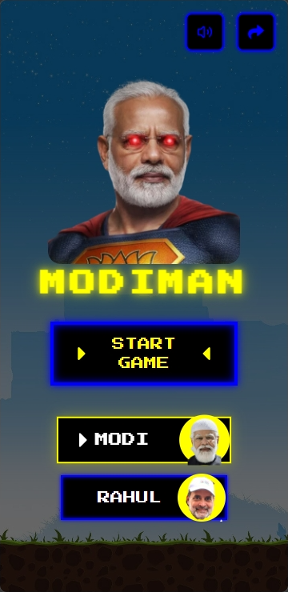

<div align="center">


# MODIMAN 

### Khela Hobe 🕹️

*Eat dots. Dodge opponents. Score high. Just for fun.*

[](https://modiman-xi.vercel.app/)
[](https://vitejs.dev/)
[](https://react.dev/)
[](https://www.typescriptlang.org/)
[](https://web.dev/progressive-web-apps/)

---

### 📸 Preview

| Desktop | Mobile |
|:---:|:---:|
|  |  |

</div>

---

## 🎮 What is Modiman?

**Modiman** is a Pac-Man inspired browser arcade game with an Indian political twist — built entirely for fun. Choose your character, navigate the maze, collect dots and power pellets, and outrun your opponents!

> ⚠️ *This game is purely for entertainment. It is not affiliated with or related to any political party or public figure.*

---

## ✨ Features

- 🟡 **Classic Pac-Man gameplay** — dots, power pellets, and chasing ghosts
- 👤 **Two playable characters** — pick MODI or RAHUL, each with unique opponents
- 🧠 **Smart ghost AI** — enemies hunt you down using pathfinding
- 📱 **Fully responsive** — works on mobile, tablet, and desktop
- ⛶ **Fullscreen mode** — tap the button or use your first D-Pad input on mobile to go fullscreen
- 🎵 **Dynamic audio** — background music, character sound effects, win/loss clips
- 🔇 **Mute toggle** — silence the game anytime
- 📸 **Score sharing** — screenshot your final score and share it natively or via the share sheet
- 💾 **High score persistence** — your best score is saved locally
- 📲 **PWA** — install it on your phone like a native app

---

## 🕹️ Controls

| Input | Action |
|-------|--------|
| `Arrow Keys` / `W A S D` | Move player |
| D-Pad (mobile) | Move player |
| `⛶` button (mobile header) | Toggle fullscreen |
| `🔇` button | Toggle mute |

---

## 🚀 Tech Stack

| Layer | Tech |
|-------|------|
| ⚡ Build Tool | [Vite 6](https://vitejs.dev/) |
| ⚛️ UI | [React 18](https://react.dev/) + [TypeScript](https://www.typescriptlang.org/) |
| 🎨 Styling | [Tailwind CSS v4](https://tailwindcss.com/) |
| 🗺️ Routing | [React Router v7](https://reactrouter.com/) |
| 📷 Screenshot | [html2canvas](https://html2canvas.hertzen.com/) |
| 📲 PWA | [vite-plugin-pwa](https://vite-pwa-org.netlify.app/) |
| 🎮 Icons | [React Icons](https://react-icons.github.io/react-icons/) |

---

## 📦 Getting Started

```bash
# Clone the repo
git clone https://github.com/itzpa1/modiman.git
cd modiman

# Install dependencies
npm install

# Start dev server
npm run dev
```

Open [http://localhost:5173](http://localhost:5173) in your browser.

### Build for production

```bash
npm run build
npm run preview
```

---

## 📁 Project Structure

```
modiman/
├── public/               # Static assets (favicon, PWA icons, OG images)
├── src/
│   ├── app/
│   │   ├── components/   # Button, DPad, ShareSheet
│   │   ├── pages/        # StartPage, GamePage, WinLossPage
│   │   ├── routes.tsx
│   │   └── App.tsx
│   ├── assets/
│   │   ├── audio/        # Sound effects & background music
│   │   ├── characters/   # Character image assets
│   │   └── win/          # Win/loss videos & photos
│   ├── styles/           # Tailwind CSS & theme tokens
│   └── main.tsx
├── index.html
└── vite.config.ts
```

---

## 🌐 Deployment

The project is deployed on **Vercel** and auto-deploys on every push to `main`.

👉 **[https://modiman-xi.vercel.app/](https://modiman-xi.vercel.app/)**

You can also deploy to [Netlify](https://netlify.com) or [GitHub Pages](https://pages.github.com/) with zero config.

---

## 🙌 Credits

- Inspired by the classic **Pac-Man** arcade game by Namco
- Built with ❤️ by **[code.itzpa1](https://github.com/itzpa1)**

---

<div align="center">

*If you liked the project, drop a ⭐ on the repo — it means a lot!*

[](https://github.com/itzpa1/modiman)

</div>